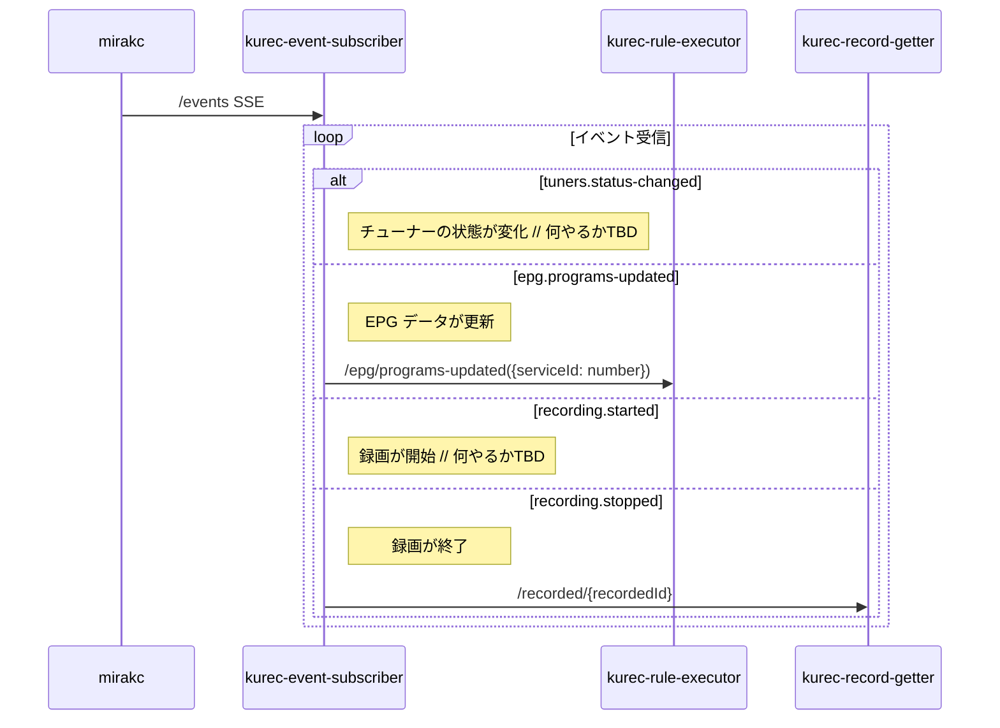

# ドキュメント

```mermaid
sequenceDiagram
    participant mirakc
    participant event-subscriber as kurec-event-subscriber
    participant rule-executor as kurec-rule-executor
    participant record-getter as kurec-record-getter

    mirakc ->> event-subscriber: /events SSE
    loop イベント受信
        alt tuners.status-changed
            note right of event-subscriber: チューナーの状態が変化 // 何やるかTBD
        else epg.programs-updated
            note right of event-subscriber: EPG データが更新
            event-subscriber ->> rule-executor: /epg/programs-updated({serviceId: number})
        else recording.started
            note right of event-subscriber: 録画が開始 // 何やるかTBD
        else recording.stopped
            note right of event-subscriber: 録画が終了
            event-subscriber ->> record-getter: /recorded/{recordedId}
        end
    end
```
